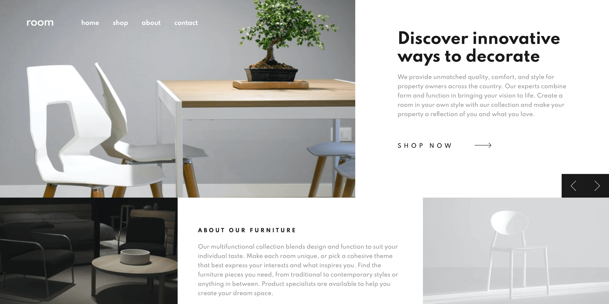

## Room Furniture

#### By Carolyn Lau

#### E-commerce landing page

## Built with

- Semantic HTML markup
- SCSS
- Javascript
- Mobile-first approach

## Description

This landing page introduces users to Room Furniture products in a responsive layout. The desktop view features interactive hover states, while the mobile view includes a hamburger menu. Users can navigate the carousel using either their mouse/touch or keyboard.

### Screenshot



## Set-up

1. Clone this repository to your desktop. [Room Furniture](https://github.com/the-cl/room 'Room Furniture')
2. Navigate to the top level of the directory.
3. Open index.html in your web browser.

### Project Goals and Challenges

The goal of this project was to construct a visually appealing landing page that allowed users to view optimal layout of the website, regardless of their screen size. Designs at width of 375px and 1440px were provided by Frontendmentor.io.

The most challenging part of the process was creating the desktop layout for extra large screen sizes (greater than 1440px by 900px). Additional styles were implemented at minimium width breakpoints of 1800px and 4000px to maintain a consistent layout and user experience.

```css
@media screen and (min-width: 112.5rem) {
  .hero__image {
    min-width: 50%;
  }
}

@media screen and (min-width: 250rem) {
  .hero__cta .cta-title {
    font-size: 4rem;
  }
}
```

### Continued development

I am growing more comfortable with using SCSS preprocessor to write and organize my styles. I hope to explore more usage of Sass variables, specifically to toggle themes or dark mode.

### Acknowledgements

Design and assets courtesy of Frontendmentor.io.
